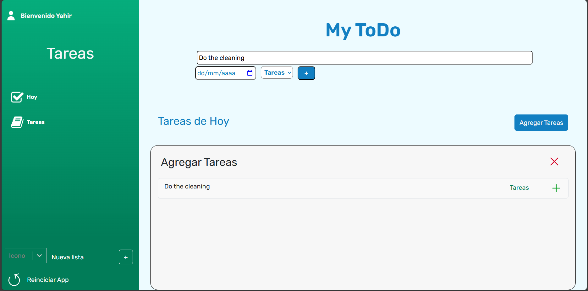

<link rel="stylesheet" type='text/css' href="https://cdn.jsdelivr.net/gh/devicons/devicon@latest/devicon.min.css" />

# ToDo App with React

ToDo app inspired on Microsoft ToDo. This web application organizes tasks into lists and add them to a daily section.

🔗 **Preview_** https://my-todo-appx.netlify.app/

## 📸 Screenshots
<video src="./src/assets/screenshots/mobile.mp4" title="Mobile demo" autoplay controls></video>

## 🛠️ Tech Stack

- **Basic Stack:**
        <i class="devicon-html5-plain-wordmark colored"></i>
        <i class="devicon-css3-plain colored"></i>
        <i class="devicon-javascript-plain colored"></i>  &nbsp; HTML, CSS & JavaScript
- **Frontend Frameworks:**: 
        <i class="devicon-react-plain colored"></i>
        <i class="devicon-reactrouter-plain colored"></i>
        <i class="devicon-sass-plain colored"></i>
        &nbsp; React + React Router